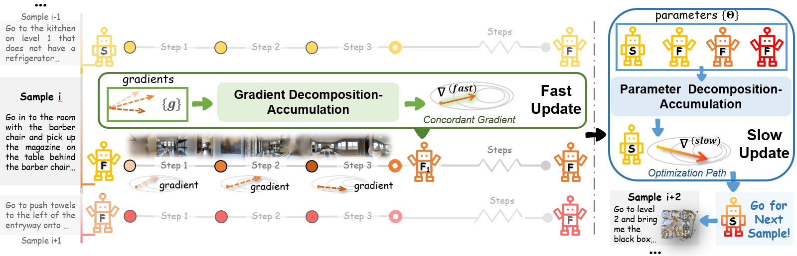

# ICML2024-FSTTA
Fast-Slow Test-time Adaptation for Online Vision-and-Language Navigation
## Introduction

### Fast-Slow Test-time Adaptation for Online Vision-and-Language Navigation

Junyu Gao, Xuan Yao, **Changsheng Xu***

*Correspondece should be addressed to C.X.

State Key Laboratory of Multimodal Artificial Intelligence Systems, Institute of Automation, Chinese Academy of Sciences.

[Paper Link on ICML 2024](https://icml.cc/virtual/2024/poster/33723) 
